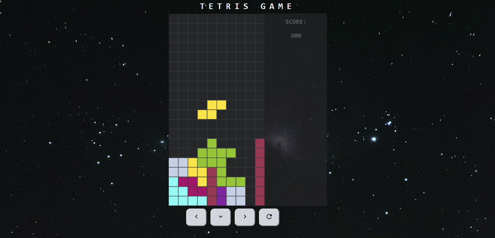

# Tetris Game

## Table of contents
* [General info](#general-info)
* [Technologies](#technologies)
* [Setup](#setup)
* [Status](#status)
* [Contact](#contact)

## General info
This is tile-matching puzzle game. The objective of tetris is to manipulate shapes (tetrominos), by moving each one sideways and/or rotating by quarter-turns, so that they form a horizontal line without gaps. When such a line is formed, it disappears and any blocks above it fall down to fill the space and the player scores points.

You can use the buttons to manipulate tetromino or control it on the keyboard:

* Left/right arrows to move the piece laterally
* Space bar to make it pivot
* Down arrow to accelerate it

## Technologies
* HTML5
* CSS
* Vanilla JS
* ESlint
* Firebase
* PWA

## Setup
To run this project, install it locally using npm:

* Clone this repository
$ git clone https://github.com/ewelina-slepko/tetris-game

* Go into the repository
$ cd tetris-game

* Install dependencies
$ npm install

* Run the app
$ npm start

* Progressive Web App - 
The game [page](https://tetris-game-2630d.firebaseapp.com/) is served as a PWA, so you can play offline on your phone.

## Status
Project is: _in progress_.

## Contact
Created by Ewelina Ślepko (slepko.ewelina@gmail.com) - feel free to contact me!
